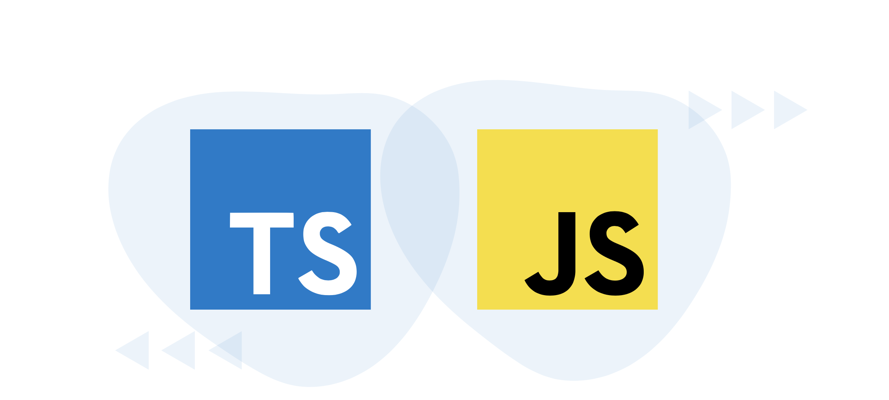

# Introduction about Typescript

## What is Typescript?

Typescript is a typed superset of JavaScript and was created by Microsoft in 2012 to aid Javascript developers with large-scale applications. Typescript was designed to help as a structuring mechanism for large codebases because it helps avoid common errors that would slow you down. It makes it easier for teams to work on the same project, as the language allows for modification and produces readable code. If there are multiple developers working on one project, Typescript can prevent a lot of wasted time on debugging.

This language allows us to use our Javascript skills more effectively. In fact, after you compile your code, all the Typescript stuff goes away and produces clean, cross-platform safe Javascript code. On top of being interoperable, Typescript adds unique features, including static typing, interfaces, classes, and more.

## TypeScript vs. JavaScript



Javascript is a dynamic scripting language used to make interactive web pages, so it’s not designed for complex applications. Typescript, on the other hand, is a static scripting language that is a superset of Javascript, meaning that it is an extra layer on top of your JS code. Typescript was not designed to supersede or replace Javascript. In fact, it never overrides existing behavior. It takes the existing behaviors of Javascript to correct its limitations and leverage common issues with the language.

There are many differences between Typescript and Javascript. Here are just a few:

-There are many differences between Typescript and Javascript. Here are just a few:
-TypeScript has static typing whereas JavaScript does not.
-TypeScript uses types and interfaces to describe how data is being used.
-TypeScript has interfaces which are a powerful way to define contracts within your code.
-TypeScript supports optional parameters for functions where JavaScript does not.

## Why should you use Typescript?

There are many important benefits to using Typescript. Let’s break them down.

Typescript catches mistakes in your JavaScript code earlier on. Typescript has the ability to catch bugs and errors before runtime, so you’ll write reliable code and mitigates the pitfalls of JavaScript that are only found at runtime.

-Transpiling allows you to generate ECMAScript, and you can specify which version of JavaScript you prefer to use. This means that you can write code that is compatible with old browsers, all while using the newest tools.

-Typescript supports JS libraries and API documentation, including JQuery, BootStrapJS, React, and more. You can use all the familiar tools you already know, so the learning curve isn’t too bad.

-Typescript introduces static typing to structure your code and improve object-oriented programming techniques. The static typing feature of Typescript also makes the code easier to refactor, since you can navigate to references of functions members.

-Typescript uses NPM, which gives you access to millions of reliable libraries. This also makes it far easier to learn Typescript, as you don’t have to make custom tools to access libraries.

-Typescript is easier to maintain. The language is generally easier to read and access. The built-in self-documentation makes it easier to check on types and objects in your code.

-Typescript makes it easier to use React, Angular, and Vue. Typescript integrates well with these frameworks, particularly React, which has been described as a perfect fit with Typescript. The usage of Typescript is not mandatory for these frameworks, but it can add productivity and ease.

## Data Types in Typescript

### What are the data types of typescript

When a variable is defined, the objective is to allocate some value to that variable, but the type of value that may be allocated to that variable is determined by its datatype. This type of system in typescript represents the many datatypes that TypeScript supports.

#### Here are the data types supported in typescript:
>Boolean

>String

>Number

>Object

>Array

>Tuple

>Enum

>Any

>Never

>Union

>Unknown

### How do you declare data types in TypeScript?

Here we will see how we can declare data types in typescript.

In TypeScript, the type syntax for declaring a variable is a colon (:) followed by the variable’s type. To declare a variable, we use the var keyword in the same way as we do in Javascript.

#### We can declare a variable with types in four ways:

1. Declare both its type and value in a single sentence.

## Example :

```ts
 var [identifier]: type annotation = value
```

2. Declare the type but not the value. The variable will be assigned to undefined in this situation.

## Example :

```ts
var [identifier]: type annotation;
```

3. Declare the value but not the type. The data type of the assigned value will be set as the variable type.


## Example :

```ts
var [identifier]= value
```

4. Declare neither the value nor the type. In this situation, the variable’s data type will be any and it will be set to undefine.

## Example :

```ts
var identifier
```


### The syntax of writing the data type in Typesript:
```ts
const {variable name}: {variable type} = {variable value}
```


## Examples with data types in TS:
let b: number = 123;

let c: number = 123.456;

let d: string = ‘Geeks’;

let e: undefined = undefined;

let f: boolean = true;

let g: number = 0b111001; // Binary

let h: number = 0o436; // Octal

let i: number = 0xadf0d; // Hexa-Decimal